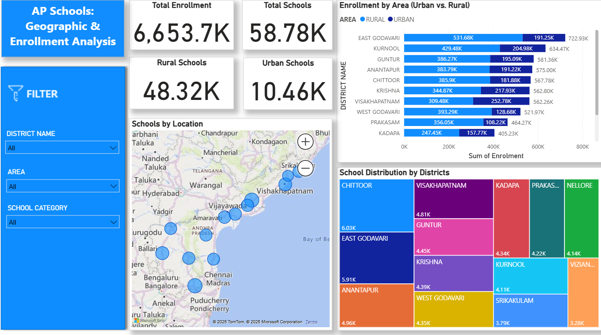

## 🔍 1️⃣ AP Schools Data Report  

📌 **Description**:  
This report provides an in-depth analysis of **Andhra Pradesh (AP) schools' data**, covering key aspects such as student enrollment, teacher distribution, school infrastructure, and academic performance.  

📌 **Key Insights**:  
✔️ **Total Enrollment**: 6.65M students across AP.  
✔️ **Total Schools**: 59K schools (48K Rural, 10K Urban).  
✔️ **Enrollment by Area**: Higher student concentration in rural areas.  
✔️ **Top Districts by Enrollment**:  
   - **East Godavari**: 722K students.  
   - **Kurnool**: 634K students.  
   - **Guntur**: 581K students.  
✔️ **School Distribution**: Chittoor has the highest number of schools (6.03K).  

📌 **Filters Available**:  
- 📍 **District-wise** selection.  
- 🏫 **Urban vs. Rural enrollment comparison**.  
- 📚 **School category filtering**.  

📌 **Tools Used**: Power BI, Excel, SQL.  

📌 **[View Full Report](https://app.powerbi.com/links/IRXHsvgegi?ctid=950737a4-2947-46ce-9c53-4728f01fd598&pbi_source=linkShare)**  

  
