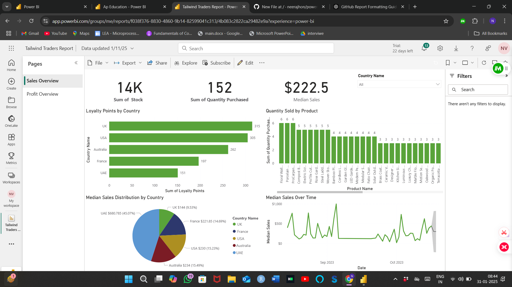
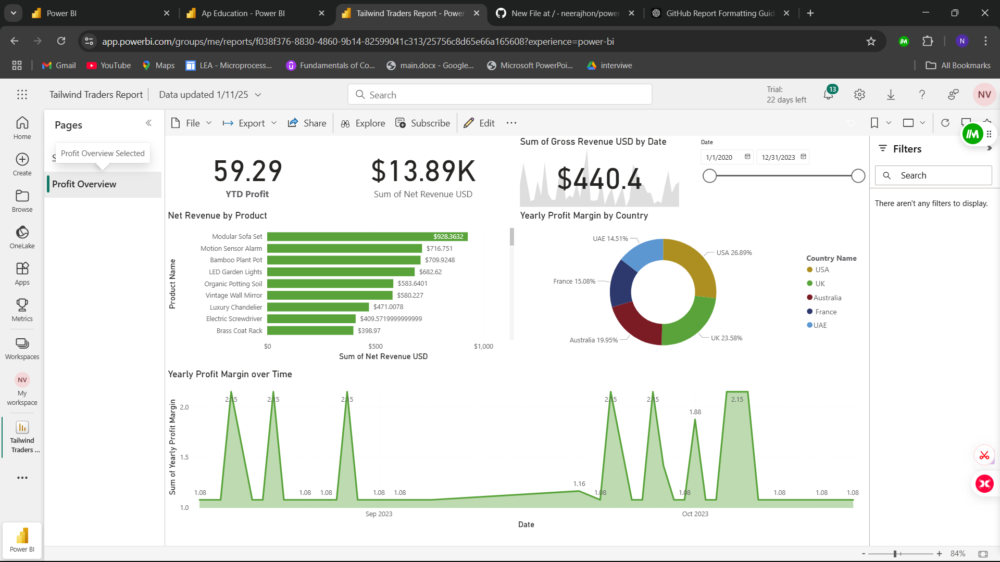

## 📊 2️⃣ Tailwind Traders Sales & Profit Dashboard

📌 **Description**:
This interactive Power BI dashboard provides a comprehensive overview of Tailwind Traders' sales performance and profitability. It is organized into two pages: "Sales Overview" and "Profit Overview," accessible through tabs within the report.

**Page 1: Sales Overview**

✔️ **Key Insights**:

* **Total Stock**: 14K units currently in stock.
* **Total Quantity Purchased**: 152 units purchased.
* **Median Sales**: $222.50 median sales value.
* **Loyalty Points Distribution**: Analysis of loyalty points earned by customers across different countries.
* **Product Performance**: Visual representation of quantity sold for each product.
* **Sales Trends Over Time**: Line chart depicting median sales over time.

**Page 2: Profit Overview**

✔️ **Key Insights**:

* **Year-to-Date (YTD) Profit**: $59.29 profit generated YTD.
* **Net Revenue**: $13.89K net revenue.
* **Gross Revenue**: $440.40 gross revenue.
* **Profit Margin by Product**: Visualization of profit margins for different products.
* **Yearly Profit Margin by Country**: Donut chart displaying the distribution of profit margins across different countries.
* **Profit Trend Over Time**: Line chart illustrating the yearly profit margin trend.

📌 **Filters Available**:

* 📍 **Country-wise** filtering to analyze sales and profitability in specific regions.
* 🗓️ **Date Range** selection to focus on specific time periods.

📌 **Tools Used**: Power BI

📌 **[View Full Dashboard (Power BI)](https://app.powerbi.com/links/azqHSlqm3y?ctid=950737a4-2947-46ce-9c53-4728f01fd598&pbi_source=linkShare)** 

 

